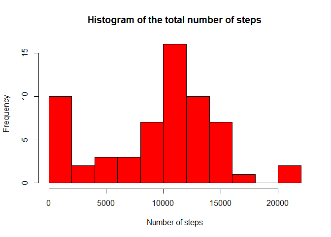
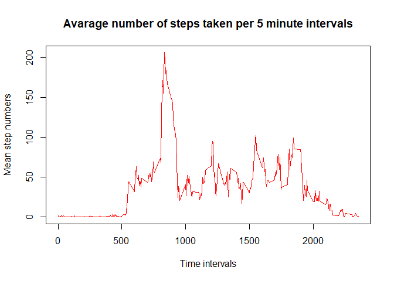
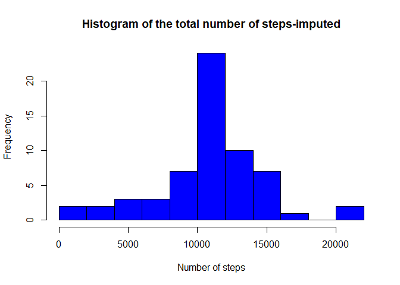
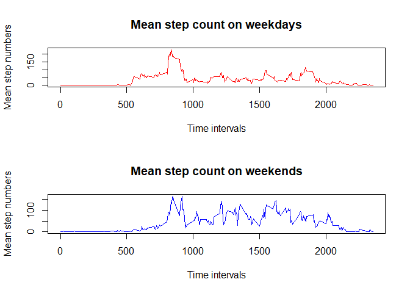

## Greetings

Hi! :)

Down below you will find the code and answers for the first assignment in the Reproducible Research course. I tried to write this document as a "report" so it might contain unnecessary information, however, I tried to write proper descriptions to each question and solution which hopefully will make my code more understandable. As English is my second language you will probably find many grammatical mistakes and typos, sorry about that :P :).

I hope you will find the code understandable and will have fun during the review.

Thank you for reading and grading my assignment! :)


## Reading in the data

n order to get and process the data, I set the working library so I can store all my assignment related files in one folder. Then I downloaded the .zip file containing the data I needed for the analysis and read in the data using the base read.csv function. This resulted in the "activity" data frame which I used for most of the analysis (Note: I manually unzipped the file in order to read it in, however, I believe you can load the data directly from the .zip file using the read_csv function from the dplyr package or using the read.table function)


```r
setwd("C:/Coursera_R/Reproducible_research")
download.file("https://d396qusza40orc.cloudfront.net/repdata%2Fdata%2Factivity.zip", "Factivity.zip")
activity <- read.csv("activity.csv")
```


## First question: What is mean total number of steps taken per day?

*1.1 Calculate the total number of steps taken per day*

First, I wanted to calculate the total number of steps taken per day, for each day. In order to calculate this, I extracted each unique date from the "date" column, then created a new vector "step_sums" which will contain the total number of steps to each day. Finally, I wrote a for loop which will substract the main data by days (it will create a sub_act data frame for the calculations, but it will be removed at the end of the loop), calculate the sum of the steps variable on that day, and stores it in the step_sums vector.  


```r
dates <- unique(activity$date)
step_sums <- vector("numeric")
for (day in seq_along(dates)) {
    sub_act <- subset(activity, activity$date == dates[day])
    step_sums[day] <- sum(sub_act$steps, na.rm = TRUE)
    rm(sub_act)
}
```

*1.2. Make a histogram of the total number of steps taken each day*

In order to visualize the distribution of the total number of steps I made a histogram using the step_sum vector. Using 15 as breaks, it seems that on most days the step count was over 10000.


```r
hist(step_sums, breaks = 15, main = "Histogram of the total number of steps", xlab = "Number of steps", col = "red")
```

<!-- -->

*1.3. Calculate and report the mean and median of the total number of steps taken per day*

Calculating the mean and median of the total number of steps taken per day.


```r
step_sum_mean <- mean(step_sums)
step_sum_median <- median(step_sums)
```

I got the following results:

- the mean of the total number of steps was: 9354.2295082

- the median of the total number of steps was: 1.0395\times 10^{4}


## Second question: What is the average daily activity pattern?

*2.1. Make a time series plot (i.e. type="l") of the 5-minute interval (x-axis) and the average number of steps taken, averaged across all days (y-axis)*

Next, to see the daily average activity pattern, I calculated the step means to each 5-minute intervals across all days. To achieve this I wrote a for loop which will subset the activity data based on the measurement intervals, then calculates the mean of the steps column across all days, and stores it in a vector named "step_means".


```r
intervals <- unique(activity$interval)
step_means <- vector("numeric")
for (timepoints in seq_along(intervals)) {
    sub_act_2 <- subset(activity, activity$interval == intervals[timepoints])
    step_means[timepoints] <- mean(sub_act_2$steps, na.rm = TRUE)
    rm(sub_act_2)
    
}
```

Then I plotted the results on a line plot, using the plot function.


```r
plot(x = intervals, y = step_means, type = "l", col = "red", xlab = "Time intervals", ylab = "Mean step numbers",
     main = "Avarage number of steps taken per 5 minute intervals")
```

<!-- -->

*2.2. Which 5-minute interval, on average across all the days in the dataset, contains the maximum number of steps?*

Next, I wanted to see wich 5-minute interval contains the maximum number of steps.


```r
max_steps_mean <- grep(max(step_means), step_means)
```

According to my calculations, the 104th 5-minute interval contains on average across all the days the maximum number of steps.


## Third question/task: Imputing missing values

*3.1. Calculate and report the total number of missing values in the dataset (i.e. the total number of rows with NAs)*

As the data contains missing values in the steps variable, working with these might introduce biases during the analysis. In order to deal with this first, I checked how many missing values there are.


```r
na_sum <- sum(is.na.data.frame(activity))
```

In total I found 2304 missing values.

*3.2-3. Devise a strategy for filling in all of the missing values in the dataset. The strategy does not need to be sophisticated. For example, you could use the mean/median for that day, or the mean for that 5-minute interval, etc.*

*Create a new dataset that is equal to the original dataset but with the missing data filled in.*

To deal with the missing values I decided to input the step value means for the respective day, which I obtained before. To achieve this I built a for loop which will loop over the steps column and trough the interval values and is looking for missing steps values. If a value is missing, it will fill it up using the mean value from the respective time interval.


```r
imputed_activity <- activity
for(e in 1:nrow(activity)) {
    for(i in seq_along(intervals)) {
        if(is.na(imputed_activity$steps[e] & imputed_activity$interval[e] == intervals[i])) {
            imputed_activity$steps[e] <- step_means[i]
        }
    }
    
}
```

The loop will result in a new data frame named "imputed_activity".

*3.4. Make a histogram of the total number of steps taken each day and Calculate and report the mean and median total number of steps taken per day. Do these values differ from the estimates from the first part of the assignment? What is the impact of imputing missing data on the estimates of the total daily number of steps?*

Now it is possible to calculate the total number of steps taken each day again using the previous loop construct.  


```r
step_sums_imputed <- vector("numeric")
for (day in seq_along(dates)) {
    sub_act <- subset(imputed_activity, imputed_activity$date == dates[day])
    step_sums_imputed[day] <- sum(sub_act$steps, na.rm = TRUE)
    
}
```

Following the calculation, one can also draw a new histogram in order to see how the imputed values change the previous calculations.


```r
hist(step_sums_imputed, breaks = 15, main = "Histogram of the total number of steps-imputed",
     xlab = "Number of steps", col = "blue")
```

<!-- -->

I also re-calculated the mean and median of the total number of steps taken per day using the new dataset.


```r
step_sum_mean_imputed <- mean(step_sums_imputed)

step_sum_median_imputed <- median(step_sums_imputed)
```

I got the following results:

- the new mean of the total number of steps was: 1.0766189\times 10^{4}

- the new median of the total number of steps was: 1.0766189\times 10^{4}

As the data shows, the imputed values changed both the distribution and the mean and median values of the total number of steps. It seems that the imputed values decrease the frequency in the 0-5000 steps region, and increases the frequency in the 10-12000 region. Furthermore, they increased both the mean and median values (and resulted in the mean value being the same).


## Fourth question: Are there differences in activity patterns between weekdays and weekends?

*4.1. Create a new factor variable in the dataset with two levels – “weekday” and “weekend” indicating whether a given date is a weekday or weekend day.*

To see if there are any differences in the activity pattern between the weekdays and the weekends, I created a new factor variable called "days" in the "imputed_activity" data frame. To achieve this I converted the values found in the date variable to actual dates, then by defining the weekdays and using an ifelse statement I designated each date to be a weekday or a weekend. Then I converted the new character values to factors with two levels: "weekday" or "weekend".


```r
imputed_activity$date <- as.Date(imputed_activity$date)
weekday <- c("Monday", "Tuesday", "Wednesday", "Thursday", "Friday")
imputed_activity$days <- ifelse(weekdays(imputed_activity$date) %in% weekday, "weekday", "weekend")
imputed_activity$days <- factor(imputed_activity$days, levels = c("weekday", "weekend"))
```

Next, I calculated the number of steps taken on each respective weekday or weekend using two similar for loops.


```r
weekday_step_means <- vector("numeric")
for (timepoints in seq_along(intervals)) {
    sub_act_2 <- subset(imputed_activity, imputed_activity$interval == intervals[timepoints] & imputed_activity$days == "weekday")
    weekday_step_means[timepoints] <- mean(sub_act_2$steps, na.rm = TRUE)
    rm(sub_act_2)
    
}

weekend_step_means <- vector("numeric")
for (timepoints in seq_along(intervals)) {
    sub_act_2 <- subset(imputed_activity, imputed_activity$interval == intervals[timepoints] & imputed_activity$days == "weekend")
    weekend_step_means[timepoints] <- mean(sub_act_2$steps, na.rm = TRUE)
    rm(sub_act_2)
    
}
```


*4.2. Make a panel plot containing a time series plot (i.e. type="l") of the 5-minute interval (x-axis) and the average number of steps taken, averaged across all weekday days or weekend days (y-axis). See the README file in the GitHub repository to see an example of what this plot should look like using simulated data.*

Using the calculated step means for the weekdays and weekends I created a two-panel time series plot, showing the differences in activity between the two.


```r
par(mfrow = c(2, 1))
plot(x = intervals, y = weekday_step_means, type = "l", col = "red",
     xlab = "Time intervals", ylab = "Mean step numbers", main = "Mean step count on weekdays")
plot(x = intervals, y = weekend_step_means, type = "l", col = "blue",
     xlab = "Time intervals", ylab = "Mean step numbers", main = "Mean step count on weekends")
```

<!-- -->

The plots revealed that there are indeed differences between the mean step counts on the weekdays and weekends, suggesting that the general activity lower on the weekends, compared to the weekdays.


